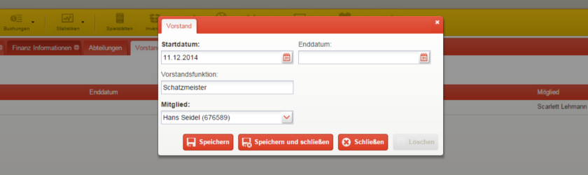

Veränderungen im Vorstand
=========================

Tritt ein Vorstandsmitglied zurück, oder wird der Vorstand um ein weiteres Mitglied erweitert, so sollte dies auch in der Software vermerkt werden.

**Vorstandsmitglied hinzufügen**

1. Öffnen Sie über die gelbe Menüleiste die Seite *Verein*

2. Gehen Sie im Abschnitt *Vorstandsmitglieder* auf die Schaltfläche_ *Neu*, um ein Vorstandsmitglied anzulegen

3. Tragen Sie nun ein, seit wann der Vorstandsposten ausgeübt wird, welche Funktion er erfüllt und von welchem Mitglied er wahrgenommen wird

4. Speichern Sie Ihre Eingaben durch betätigen der entsprechenden Schaltfläche_ und wiederholen Sie die Schritte gegebenenfalls, um weitere Vorstandsmitglieder anzulegen

**Vorstandsmitglied entfernen**

1. Öffnen Sie über die gelbe Menüleiste die Seite *Verein*

2. Öffnen Sie das auszuschließende Mitglied über den Reiter_ *Vorstandsmitglieder*

3. Steuern Sie im neuen Fenster den Reiter_ *Vorstand für* an, und doppelklicken Sie auf den Vorstandsposten, welcher beendet werden soll

4. Setzen Sie das Enddatum und bestätigen Sie Ihre Eingabe durch einen Klick auf die entsprechende Schaltfläche

.. image:: ../images/gui/vorstandsmitglied-entfernen.png

.. _Auswahlmenü: /de/latest/erste-schritte/benutzeroberflaeche.html#auswahl-menus
.. _Schaltfläche: /de/latest/erste-schritte/benutzeroberflaeche.html#schaltflachen
.. _Reiter: /de/latest/erste-schritte/benutzeroberflaeche.html#reiter
.. _Tab: /de/latest/erste-schritte/benutzeroberflaeche.html#reiter
.. _Tabs: /de/latest/erste-schritte/benutzeroberflaeche.html#reiter
