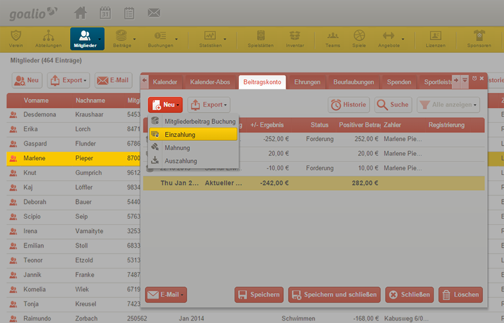
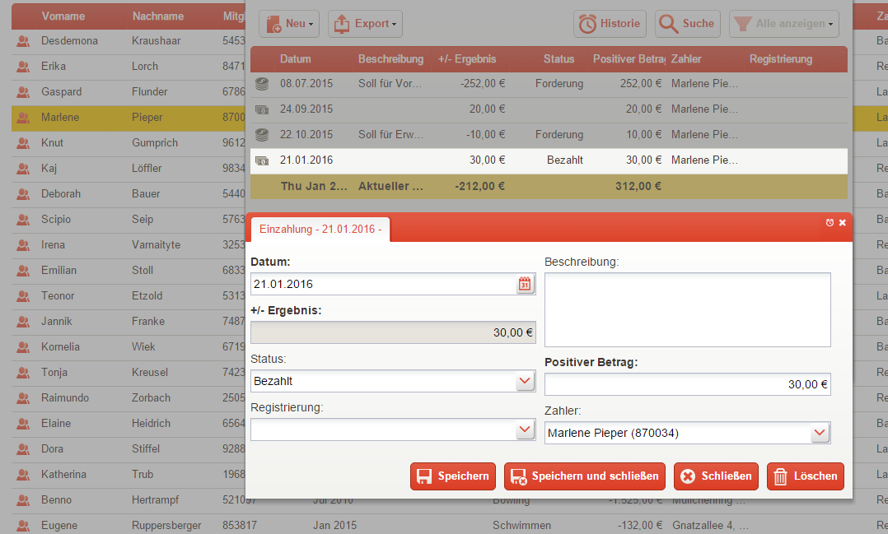

Eingegangene Zahlung verbuchen
==============================

Hat ein Mitglied seinen Beitrag auf das Vereinskonto eingezahlt, so muss dies auch in der Software vermerkt werden.

1. Doppelklicken Sie dafür zunächst auf das entsprechende Mitglied in der Mitgliederliste

2. Öffnen Sie den Reiter_ *Beitragskonto*

3. Betätigen Sie die Schaltfläche_ *Neu* und wählen Sie aus dem Listenmenü_ den Punkt *Einzahlung* aus

4. Geben Sie an, wann die Zahlung (*Datum*) in welcher Höhe (*Positiver Betrag*) erfolgt ist, und notieren Sie relevante Informationen zur Transaktion im Textfeld *Beschreibung*

5. Geben Sie durch das Feld *Status* an, ob der Beitrag bezahlt, zurückgebucht, unbestätigt oder per Lastschrift eingezogen worden ist

6. Speichern Sie Ihre Eingaben durch Betätigen der entsprechenden Schaltfläche_

7. Das Beitragskonto_ beziehungsweise der Saldo berechnet sich nun automatisch neu und das Fenster kann geschlossen werden

.. _Listenmenü: /de/latest/erste-schritte/benutzeroberflaeche.html#auswahl-menus
.. _Reiter: /de/latest/erste-schritte/benutzeroberflaeche.html#reiter
.. _Schaltfläche: /de/latest/erste-schritte/benutzeroberflaeche.html#schaltflachen
.. _Beitragskonto: /de/latest/module/finanzen/konten.html