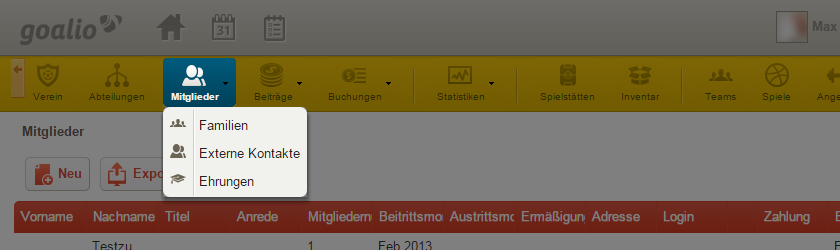
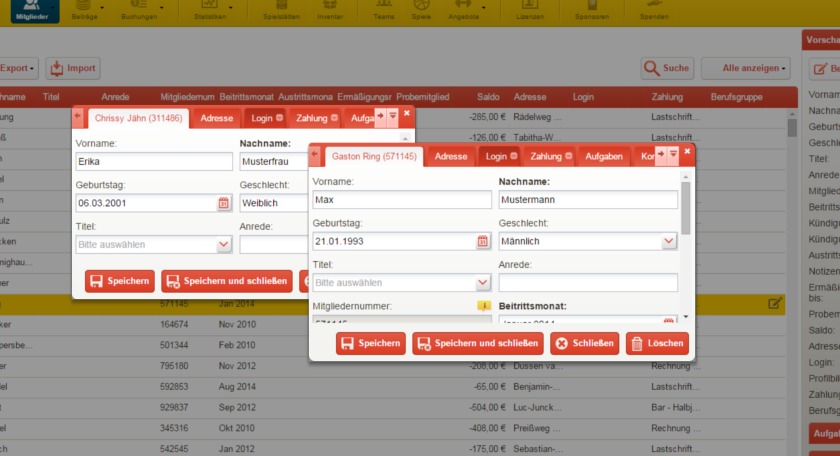
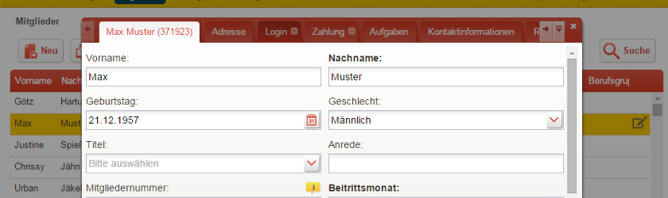
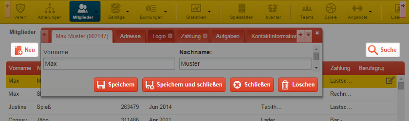
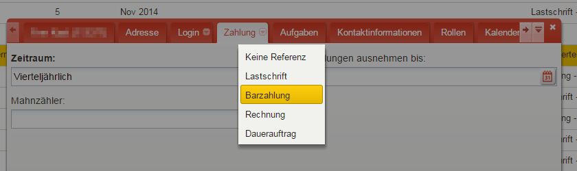
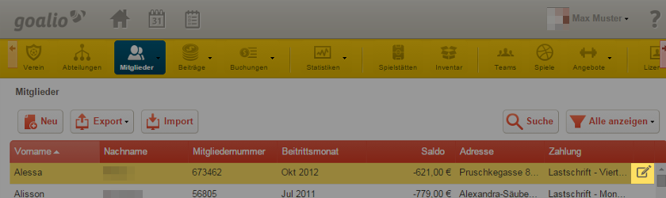
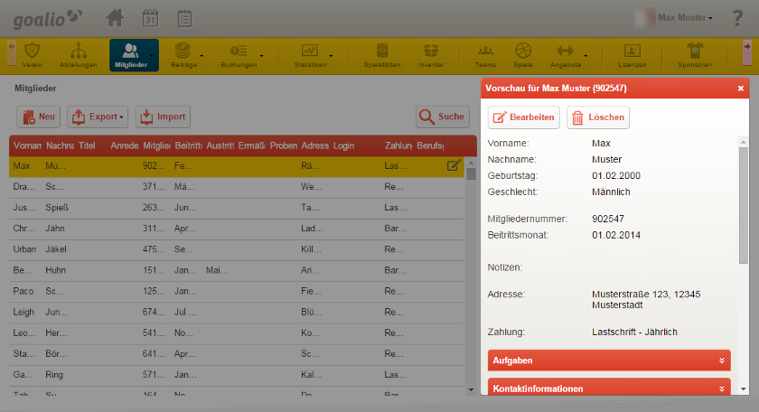

Benutzeroberfläche
==================

Einleitung
----------

Hat man die grundlegenden Prinzipien der goalio-Benutzeroberfläche einmal verstanden, so können selbst komplexe Operationen problemlos durchgeführt werden. Um also sicherzustellen, dass Sie bei der Benutzung von goalio keine Probleme haben, möchten wir Sie mit diesem Leitfaden in die wesentlichen Bedienelemente einführen.

Navigation
--------------

Das zentrale Steuerelement in goalio ist die gelbe/graue Menüleiste, welche sich über dem Seiteninhalt befindet. Bewegen Sie Ihren Mauszeiger auf einen der Einträge, um die verfügbaren Unterseiten angezeigt zu bekommen. Die momentan geöffnete Seite wird dabei blau hinterlegt.

.. note ::
	Sollte das Menü nicht oder nicht richtig dargestellt werden, so stellen Sie bitte sicher, dass Javascript in Ihrem Browser aktiviert ist.  Eine Anleitung dazu finden Sie hier_.
	
.. _hier: http://www.enable-javascript.com/de/

Komponenten
------------

In goalio werden unterschiedliche Techniken angewandt, um Daten intuitiv und übersichtlich darzustellen. Folgende Komponenten stellen dabei die wichtigsten dar:

Fenster
.......

Ein Fenster (bzw. Formular oder Dialog) öffnet sich in der Regel bei einem Doppelklick auf einen Datensatz (also beispielsweise ein Mitglied in der Mitgliederliste), welcher daraufhin in der Regel bearbeitet werden kann.

Fenster verschieben
"""""""""""""""""""

Möchten Sie ein Fenster verschieben, so halten Sie den linken Mauszeiger auf der roten Titelleiste gedrückt. Haben Sie das Fenster dann an die gewünschte Position geschoben, können Sie die Maustaste wieder loslassen.

Fenstergröße ändern
"""""""""""""""""""

Ist Ihnen ein Fenster zu groß oder zu klein, so können Sie dessen Maße ohne großen Aufwand ändern: Gehen Sie dabei mit der Maus auf den Rand oder eine Ecke des Fensters, bis sich der Cursor in einen Pfeil verwandelt. Klicken beziehungsweise halten Sie dann die linke Maustaste gedrückt und ziehen Sie das Fenster, bis es die gewünschte Größe erreicht hat.

Mehrere Fenster öffnen
""""""""""""""""""""""

Eine weitere nützliche Funktion ist die Möglichkeit, in mehreren offenen Fenstern gleichzeitig zu arbeiten. Beachten Sie dabei, dass sich ein geöffnetes Fenster beim Aufrufen einer neuen Seite wieder schließt und Sie so lediglich Datensätze der gleichen Art (zwei Mitglieder, zwei Abteilungen, ...) simultan bearbeiten können.

Reiter
......

Ist ein Fenster durch ein horizontales Menü in unterschiedliche Abschnitte gegliedert, so spricht man von Reitern (oder Tabs). Betrachtet man also die Mitgliederliste, so handelt es sich bei einem Mitglied um einen Datensatz, beim Bearbeiten-Formular um ein Fenster, und bei den dortigen Abschnitten *Adresse*, *Zahlung* oder *Aufgaben* um Reiter.

Schaltflächen
.............

Schaltflächen (auch Buttons oder Knöpfe) sind Bedienelemente, welche das System anweisen, eine bestimmte Operation auszuführen. Beispiele hierfür sind die Schaltflächen *Speichern*, *Löschen* oder auch *Suche*.

Auswahl-Menüs
.............

Auswahl-Menüs (auch Dropdown-Menüs oder Listenmenüs) sind eine platzsparende Möglichkeit, mehrere Listenpunkte verschachtelt darzustellen. Sie öffnen sich erst, sobald sich der Mauszeiger auf der dafür vorgesehenen Fläche befindet.

Bearbeiten-Stift
----------------

Der Bearbeiten-Icon (auch Bearbeiten-Knopf oder Bearbeiten-Stift) dient dazu, einen Datensatz schnell und unkompliziert zu verarbeiten. Sichtbar wird er, sobald sich der Mauszeiger über dem entsprechenden Datensatz befindet. Die einem zur Verfügung stehenden Optionen können dabei durch einen Klick auf den Stift in Form eines Listenmenüs ausgeklappt werden.

Operatoren
..........

Operatoren können in Suchfeldern angeben, wie ein bestimmtes Kriterium ausgewertet werden soll. Wählt man beispielsweise *ist gleich*, so werden ausschließlich jene Ergebnisse angezeigt, die exakt mit dem Kriterium übereinstimmen. Möglich ist die Verwendung folgender Operatoren:

====================  =======
Operator              Wirkungsweise
====================  =======
Beginnt mit           Liefert alle Ergebnisse, die mit der Eingabe beginnen (Mus **>** Mustermann, Muse)
Enthält               Liefert alle Ergebnisse, welche die Eingabe beinhalten (ster **>** Mustermann, Holstern)
Ist gleich            (Bei Zahlen oder Datumsangaben) Liefert alle Ergebnisse, die mit der Eingabe exakt übereinstimmen
Größer oder gleich    (Bei Datumsangaben) Liefert alle Ergebnisse, bei denen das Datum in der **Zukunft** liegt oder nicht ausgefüllt ist
Kleiner oder gleich   (Bei Datumsangaben) Liefert alle Ergebnisse, bei denen das Datum in der **Vergangenheit** liegt oder nicht ausgefüllt ist
Ist nicht gleich      (Bei Datumsangaben) Liefert alle Ergebnisse, die nicht dem Datum entsprechen
Nicht gesetzt         Liefert alle Ergebnisse, bei denen dieses Feld nicht ausgefüllt ist
Gesetzt               Liefert alle Ergebnisse, bei denen dieses Feld ausgefüllt ist
====================  =======

.. image:: ../images/gui/operator.png

Vorschaufunktion
----------------

Haben Sie eine Datenübersicht (Mitgliederliste,  Abteilungsliste, ...) geöffnet, so können Sie durch Klick auf einen der Einträge die Vorschaufunktion aufrufen. Diese erscheint am rechten Bildschirmrand und stellt die wichtigsten Daten und Funktionen zum ausgewählten Datensatz übersichtlich dar.

Sollten Sie zusätzlich dazu das *Bearbeiten*-Fenster öffnen und Änderungen vornehmen, so werden diese nach dem Speichern von der Vorschau-Funktion übernommen.

Tastenkürzel
------------

===============  ===============
Eingaben         Funktion
---------------  ---------------
:kbd:`Strg+S`    speichert aktuelle Änderungen
:kbd:`Strg+C`    kopiert markierte Eingabe
:kbd:`Strg+V`    fügt kopierte Eingabe ein
:kbd:`ESC`       schließt aktives Fenster / den Vorschau-Bereich
===============  ===============

