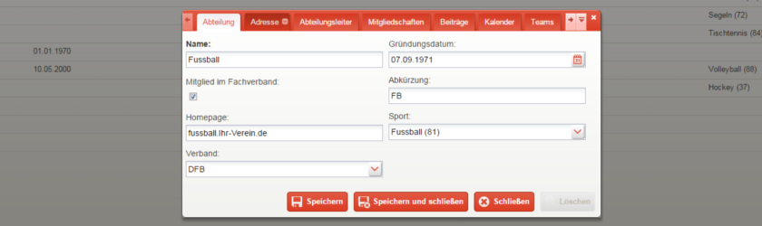

Grundeinstellungen
==================

Einleitung
----------

Sind Sie neu in goalio, so sollten Sie zunächst grundlegenden Einstellungen prüfen und die wichtigsten Daten zu Ihrem Verein hinterlegen. Auf dieser Seite zeigen wir Ihnen, wie Sie dabei vorgehen können.

Stammdaten und Kontaktdaten hinterlegen
---------------------------------------

Gehen Sie folgendermaßen vor, um die Kerninformationen Ihres Vereins in der Software zu hinterlegen:

1. Öffnen Sie über die gelbe Menüleiste die Seite *Verein*

2. Geben Sie auf der neuen Seite den Namen, das Gründungsdatum, die LSB-Nummer, die Steuernummer (falls vorhanden), die Webseiten-Adresse sowie den Bezirk an, in welchem Sie tätig sind

3. Wechseln Sie auf den Reiter_ *Adresse* und füllen Sie die dortigen Felder mit der Anschrift des Vereinssitzes aus

4. Steuern Sie nun den Abschnitt *Kontaktinformationen* an, um Telefonnummer(n) und E-Mail Adresse(n) des Vereins abzuspeichern

5. Speichern Sie Ihre Eingaben durch betätigen der entsprechenden Schaltfläche_

Finanzinformationen des Vereins
-------------------------------

1. Öffnen Sie über die gelbe Menüleiste die Seite *Verein*

2. Gehen Sie nun auf den Reiter_ *Bank Information* und geben Sie an, welche Daten das Vereinskonto hat. Läuft das Konto über eine Person, so können Sie deren Namen im Feld *Zahler* eingeben.

3. Wählen Sie über das Auswahlmenü_ im Reiter *Finanz Informationen* den Punkt *Finanz Information* aus, und geben Sie auf der sich daraufhin öffnenden Seite ein, wann das Geschäftsjahr beginnt, welches Finanzamt zuständig ist, ob beziehungsweise seit wann der Verein einen Freistellungsbescheid hat, und - sofern zutreffend - seit wann und mit welchem Zweck der Verein gemeinnützig ist.

4. Speichern Sie Ihre Eingaben durch betätigen der entsprechenden Schaltfläche_

Vereinsstruktur anlegen
-----------------------

1. Öffnen Sie über die gelbe Menüleiste die Seite *Verein*

2. Steuern Sie nun den Reiter_ *Abteilungen* an und legen Sie durch betätigen der Schaltfläche_ *Neu* eine erste Abteilung an

3. Geben Sie im neuen Fenster den Namen, das Gründungsdatum, das Kürzel und die Sportart ein. Sofern zutreffend können Sie ebenfalls noch eine Mitgliedschaft im Fachverband, eine spezielle Webseite der Abteilung sowie eine Verbandsmitgliedschaft hinterlegen.

4. Weicht die Adresse der Abteilung von der Adresse des Vereins ab, so können Sie im Abschnitt *Adresse* eine spezielle Abteilungsanschrift hinterlegen

5. Ist ein Abteilungsleiter vorhanden, so können Sie diesen im Reiter_ *Abteilungsleiter* festlegen

6. Haben Sie bereits Beiträge angelegt, die für Mitglieder der Abteilung fällig werden sollen, so haben Sie im Tab_ *Beiträge* die Möglichkeit, diese zuzordnen

7. Je nach Größe der Abteilung kann es nützlich sein, über den entsprechenden Reiter_ einen Kalender hinzuzufügen, mit welchem Termine organisiert werden können

8. Ist eine Abteilung in mehrere Teams unterteilt, so können Sie diese im Tab_ *Teams* festlegen

9. Speichern Sie Ihre Eingaben durch betätigen der entsprechenden Schaltfläche_ und wiederholen Sie die Schritte gegebenenfalls, um weitere Abteilungen anzulegen

Vorstandsmitglieder anlegen
---------------------------

1. Öffnen Sie über die gelbe Menüleiste die Seite *Verein*

2. Gehen Sie im Abschnitt *Vorstandsmitglieder* auf die Schaltfläche_ *Neu*, um ein Vorstandsmitglied anzulegen

3. Tragen Sie nun ein, seit wann der Vorstandsposten ausgeübt wird, welche Funktion er erfüllt und von welchem Mitglied er wahrgenommen wird

4. Speichern Sie Ihre Eingaben durch betätigen der entsprechenden Schaltfläche_ und wiederholen Sie die Schritte gegebenenfalls, um weitere Vorstandsmitglieder anzulegen

.. image:: ../images/gui/vorstandsmitglied-anlegen.png

.. _Auswahlmenü: /de/latest/erste-schritte/benutzeroberflaeche.html#auswahl-menus
.. _Schaltfläche: /de/latest/erste-schritte/benutzeroberflaeche.html#schaltflachen
.. _Reiter: /de/latest/erste-schritte/benutzeroberflaeche.html#reiter
.. _Tab: /de/latest/erste-schritte/benutzeroberflaeche.html#reiter
.. _Tabs: /de/latest/erste-schritte/benutzeroberflaeche.html#reiter

