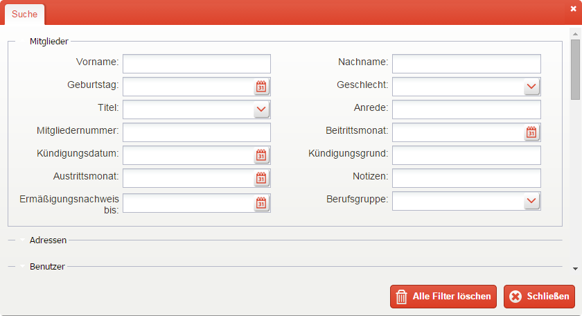
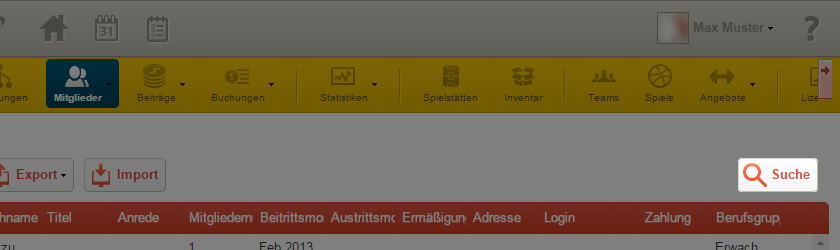
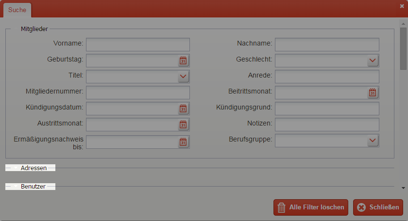
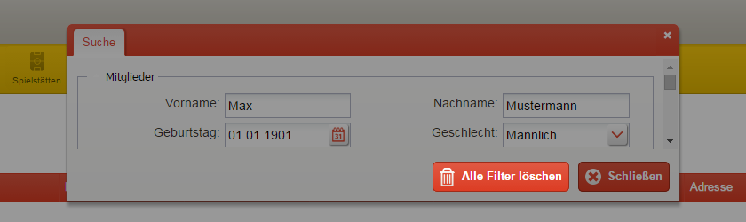
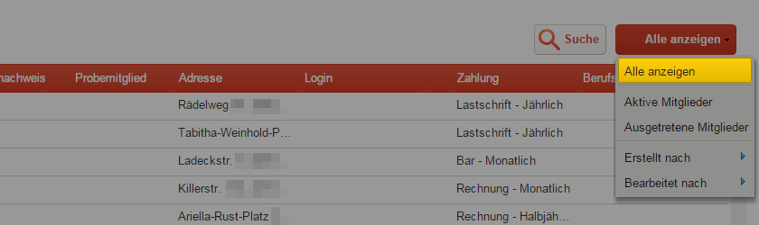

Suche
=====

Einleitung
----------

Die goalio Suche ist ein nützliches Werkzeug, um Informationen gezielt schnell und übersichtlich darzustellen. Sie kann durch einen Klick auf die entsprechende Schaltfläche rechts über einer Liste aufgerufen werden. Die Suche wird automatisch um neue Datenfelder erweitert, sobald diese z.B. in der Mitglieder-Eingabemaske eingefügt werden. Dadurch können selbst vereins-spezifische Datenfelder durchsucht werden.

Einen Suchfilter anwenden
-------------------------

Um eine Liste zu filtern, können Sie die Kriterien, nach denen dies geschehen soll, direkt in den dafür vorgesehenen Eingabefeldern einstellen. Gehen Sie dabei folgendermaßen vor:

1. Öffnen Sie die *Suche* über die entsprechende Schaltfläche

2. Standardmäßig wird der Abschnitt *Mitglieder* mit den dazugehörigen Suchkriterien bereits geöffnet dargestellt. Sollten Sie andere Kriterien benötigen (wie zum Beispiel die Adresse, oder die Team-Zugehörigkeit), so können Sie diese durch Klicken auf die jeweilige Abschnitts-Überschrift ebenfalls ausklappen lassen:

3. Haben Sie einen Suchfilter eingegeben, so aktualisiert sich die durchsuchte Liste automatisch. Er bleibt auch dann aktiv, wenn Sie das Fenster *Suche* schließen und wird beispielsweise von der Exportfunktion übernommen.

Suchfilter entfernen
--------------------

Haben Sie einen Suchfilter angewandt, so gibt es mehrere Möglichkeiten, diesen wieder zu deaktivieren:

Einzeln
^^^^^^^

Um individuell auszuwählen, welcher Suchfilter gelöscht werden soll, klicken Sie in der entsprechenden Eingabemaske rechts auf das kleine Kreuz. Haben Sie dies getan, so wird der jeweilige Filter entfernt, die Mitgliederliste aktualisiert, und die anderen Filter beibehalten.

.. image:: ../images/gui/suchfilter-entfernen.png

Alle Filter löschen
^^^^^^^^^^^^^^^^^^^

Um die gesamte Mitgliederliste ungefiltert darzustellen, betätigen Sie die Schaltfläche_ *Alle Filter löschen*.

Achten Sie auch darauf, dass im Auswahlmenü_ rechts neben der *Suche* der Punkt *Alle anzeigen* ausgewählt ist, sodass die Darstellung durch kein zusätzliches Kriterium beeinflusst wird.

.. note::
	Haben Sie einen Suchfilter aktiviert, so wird er beispielsweise von der Exportfunktion übernommen.

.. _Auswahlmenü: /de/latest/erste-schritte/benutzeroberflaeche.html#auswahl-menus
.. _Schaltfläche: /de/latest/erste-schritte/benutzeroberflaeche.html#schaltflachen
