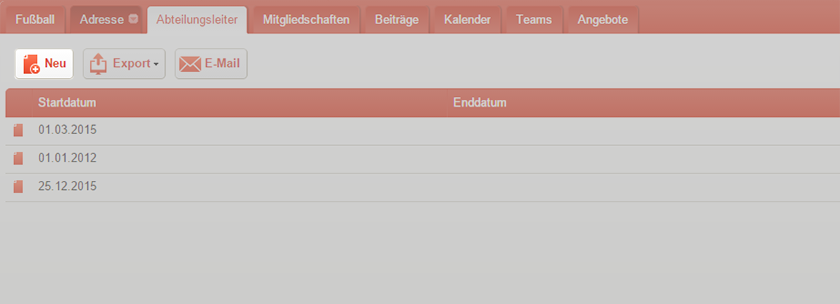
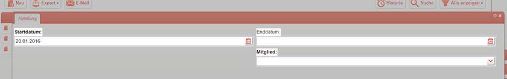
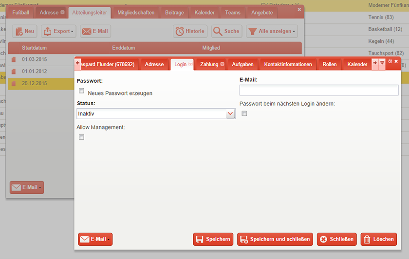

Abteilungsleiter
================

Nachdem Sie eine Abteilung angelegt haben, haben Sie die Möglichkeit den Abteilungen Leiter zuzuweisen. Abteilungsleiter sind mit den nötigen umfangreichen Rechten ausgestattet, um deren Zuständigkeitsbereich optimal zu organisieren und verwalten zu können. Grundsätzlich verfügen die Abteilungsleiter über spezifische Rechte, die sie im Rollenkatalog einsehen können.

Abteilungsleiter anlegen
------------------------
Aufgrund der sehr funktionellen Softwareoberfläche gibt es verschiedene Wege einen Abteilungsleiter anzulegen. Um Schwierigkeiten zu vermeiden, empfehlen wir folgenden Weg:

1. Klicken Sie in der *gelben Menüleiste* auf das Feld *Abteilungen*
2. Doppelklicken Sie auf die Abteilung, der Sie einen Abteilungsleiter hinzufügen möchten
3. Klicken Sie in dem geöffneten Fenster auf den Reiter *Abteilungsleiter*

4. Klicken Sie auf die Schaltfläche *Neu* und tragen Sie *Startdatum*, *Enddatum* und das *Mitglied* ein, welches die Rolle des Abteilungsleiters übernehmen soll. Sollten Sie das Enddatum nicht eintragen, erhält das Mitglied die Rolle des Abteilungsleiters auf unbestimmte Zeit

5. Speichern und Schließen Sie das Fenster

Sie haben der Abteilung erfolgreich einen Abteilungsleiter zugewiesen. Sollten Sie in Zukunft weitere Abteilungsleiter hinzufügen oder anderweitige Änderungen vornehmen, empfehlen wir Ihnen den oben genannten Weg zu nutzen.

.. tip::
 Falls Sie zu einem späteren Zeitpunkt ein *Enddatum* für die Rolle des Abteilungsleiters hinzufügen möchten, nutzen Sie dafür den Bearbeiten-Stift und wählen Sie im Auswahl-Menü das Feld Bearbeiten. TIPP: Über diesen Weg lässt sich der Abteilungsleiter ebenfalls ändern, ohne einen neuen Eintrag vornehmen zu müssen.

Der Leiter einer Abteilung ist nun für alle Mitglieder sichtbar, die das dafür nötige Recht besitzen. Allerdings ist die bisherige Eintragung vergleichbar mit einer öffentlich einsehbaren Liste, die einen rein kommunikativen Charakter besitzt - Arbeitsteilung weit gefehlt.  

Abteilungsleiter-Login vergeben
-------------------------------
Damit der Abteilungsleiter seine Arbeit verrichten kann, muss ihm ein Zugang zu goalio gewährt werden - ähnlich wie Sie Mitgliedern einen Login gewähren können.

1. Bleiben Sie im oder Kehren Sie zurück zum Reiter *Abteilungsleiter* der jeweiligen Abteilung
2. Doppelklicken Sie auf den Datensatz des neu erstellten Abteilungsleiters
3. Klicken Sie auf den Reiter Login
4. Setzen Sie den *Status* auf *Aktiv* und tragen Sie eine gültige E-Mail-Adresse ein
5. Setzen Sie ein Häkchen bei *Allow Management*

6. Speichern und Schließen Sie das Fenster

.. note:: 
 Falls ein Abteilungsleiter/Mitglied in Zukunft einmal sein Passwort vergessen sollte, können Sie mit einem Häkchen bei *Neues Passwort erzeugen* diesen Umstand beheben. Dem Abteilungsleiter/Mitglied wird ein neues Passwort zugesendet. Setzen Sie ein Häkchen bei *Passwort beim nächsten Login ändern* wird der Benutzer beim nächsten Login aufgefordert ein eigenes Passwort zu erstellen.

Nachdem Sie die Eingaben gespeichert haben, erhält der Abteilungsleiter einen Benutzerzugang zum System. Gleichzeitig wird ihm ein automatisch generiertes Passwort für den Zugang per E-Mail zugesendet. Der Abteilungsleiter ist nun nicht mehr nur eine starre Information im System, sondern eine lebendige Person, die mit Hilfe der Oberfläche Aufgaben aktiv übernehmen und mit Trainern, Spielern, Eltern kommunizieren kann.
