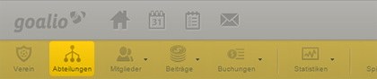

Abteilungen
===========

Egal ob großer oder kleiner Verein: jeder Verein besitzt eine Hierachie, die die alltägliche Vereinsverwaltung bestimmt. Mit goalio besitzen Sie die Möglichkeit diese Hierarchie in eine funktionelle Arbeitsumgebung zu verwandeln und sorgen somit für eine optimale Arbeitsverteilung. 

.. toctree::
   :hidden:
   
   abteilungen
   abteilungsleiter
   team