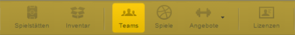
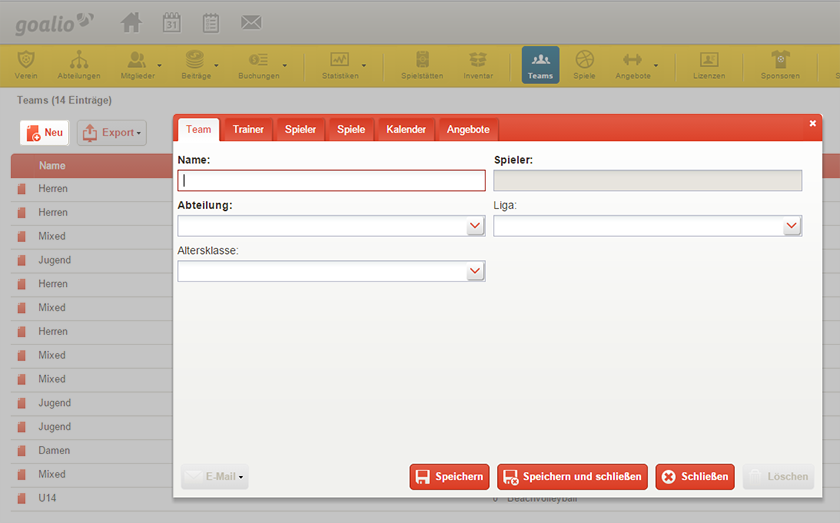

Teams
=====
Mit dem Anlegen einer oder mehrerer Abteilungen haben Sie die nötigen Voraussetzungen geschaffen Mannschaften/Teams den jeweiligen Abteilungen zuzuordnen.
 
Teams anlegen
-------------
Für das Anlegen von Mannschaften empfehlen wir folgende Schritte:

 
1. Klicken Sie in der *gelben Menüleiste* auf das Feld *Teams*
2. Klicken Sie auf die Schaltfläche *Neu*, tragen Sie den Namen der Mannschaft ein und ordnen Sie die Mannschaft einer Abteilung zu. (Optional haben Sie die Möglichkeit das Team einer Liga und eine Altersklasse zuzuweisen)
3. Klicken Sie auf Speichern und Schließen

 
Trainer hinzufügen
------------------

Nachdem Sie eine Mannschaft angelegt haben, können Sie der Mannschaft ebenfalls einen Trainer zuordnen. 

1. Klicken Sie in der *gelben Menüleiste* auf das *Feld Teams*
2. Öffnen Sie den Reiter *Trainer*
3. Bedienen Sie die Schaltfläche *Neu*, wählen Sie die Person, welche das Amt begleiten soll und tragen Sie optional ein *Enddatum* ein
4. Klicken Sie auf Speichern und Schließen

.. note::
 Stellen Sie sicher, dass der künftige Trainer bereits im System (Mitgliederliste oder externe Kontakte) als Person angelegt ist. Falls dies nicht der Fall sein, müssen Sie diesen erst noch anlegen. 

Spieler hinzufügen
------------------

Um Spieler einem Team hinzu zufügen, nutzen Sie folgende Schritte:

1. Klicken Sie in der *gelben Menüleiste* auf das Feld *Teams*
2. Öffnen Sie den Datensatz des Teams mit Doppelklick dem Sie einen Spieler hinzufügen möchten
3. Öffnen Sie den Reiter *Spieler*
4. Bedienen Sie die Schaltfläche *Neu*, wählen Sie die Person, welche dem Team hinzugefügt werden soll und tragen Sie optional ein *Enddatum* oder *Trikotnummer* ein
5. Klicken Sie auf Speichern und Schließen

Nachdem Sie ihre Mannschaften, Trainer und Spieler in goalio organisiert haben, ist es ebenfalls sinnvoll Ihren Trainern einen Zugang zu goalio zu gewähren. Mit der Vergabe eines Trainer-Logins kann der Trainer künftig seine Mannschaft eigenständig verwalten, mit ihr per E-Mail in Kontakt bleiben und Trainings-/Spieltermine in die goalio-Oberfläche einpflegen. 