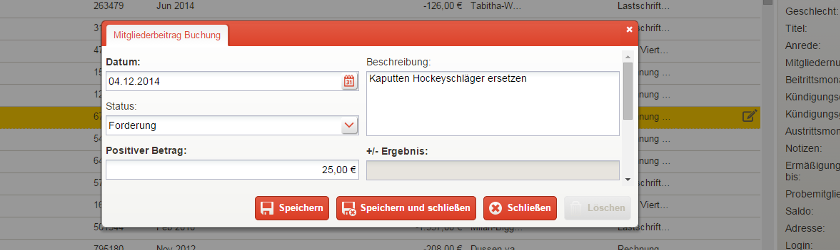

Gebühren
========

Einleitung
----------

Unregelmäßig anfallende oder nur einmal zu zahlende Beiträge werden in goalio unter dem Stichwort Gebühren geführt. So wird es Vereinen ermöglicht, Kostenpunkte schnell und unkompliziert einzutragen und abzuspeichern.

Arten von Gebühren
---------------------

Anmeldegebühr
^^^^^^^^^^^^^

Die Anmeldegebühr gehört zu den Gebühren, die vom System ohne Zutun eines Administrators abgezogen werden. Sie wird automatisch vom Beitragskonto eines neu angelegten Mitgliedes abgezogen.

Rückbuchungsgebühr
^^^^^^^^^^^^^^^^^^

Ebenfalls zu den automatisch abgezogenen Gebühren gehört die Rückbuchungsgebühr, welche beispielsweise dann anfällt, wenn man den *Status* einer Lastschrift in *Rückbuchung* umändert. Sie dient dazu, die für den Verein angefallenen Bank- und Bearbeitungskosten zu decken.

Mahngebühren
^^^^^^^^^^^^

Eine Mahngebühr wird fällig, sobald man die Mahnstufe_ eines Mitglieds ändert. Der Verein hat dabei in goalio die Möglichkeit, die Höhe der Gebühr für die ersten drei und alle weiteren Stufen unterschiedlich hoch anzusetzen.

Festlegen der automatisch abgezogenen Gebühren
----------------------------------------------

1. Öffnen Sie im Menü unter *Beiträge* den Unterpunkt *Gebühren*

2. Geben Sie im Feld der entsprechenden Gebühr die Höhe des Beitrages an, der pauschal anfallen soll

3. Speichern Sie Ihre Änderung durch betätigen der entsprechenden Schaltfläche_

Vermerken einer individuellen Gebühr
------------------------------------

Möchte man eine individuelle Gebühr für einen Spieler vermerken, so kann man das in seinem Mitgliedsprofil machen. Gehen Sie dabei wie folgt vor:

1. Öffnen Sie das Mitglied über die Mitgliederliste

2. Steuern Sie den Reiter_ Beitragskonto an und fügen Sie durch betätigen der Schaltfläche_ *Neu* eine *Mitgliederbeitrag Buchung* hinzu

3. Geben Sie im Feld *Beschreibung* den Grund für die Gebühr an, setzen Sie als *Status* den Wert *Forderung* ein und legen Sie die Höhe der Gebühr fest

.. _Mahnstufe: /de/latest/module/finanzen/mahnwesen.html
.. _Fenster: /de/latest/erste-schritte/benutzeroberflaeche.html#fenster
.. _Reiter: /de/latest/erste-schritte/benutzeroberflaeche.html#reiter
.. _Schaltfläche: /de/latest/erste-schritte/benutzeroberflaeche.html#schaltflaechen
