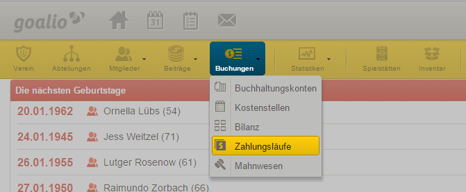
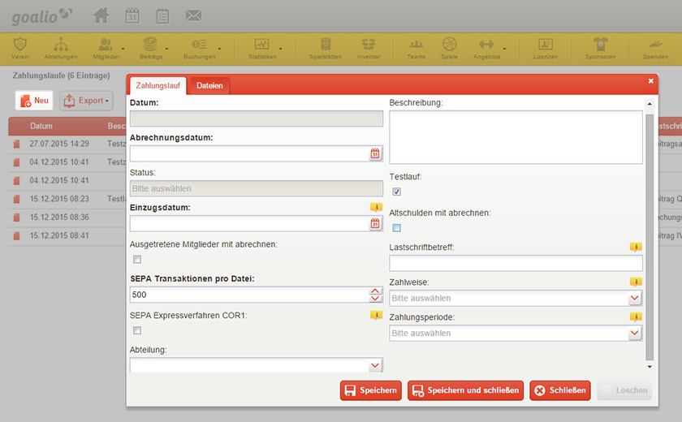
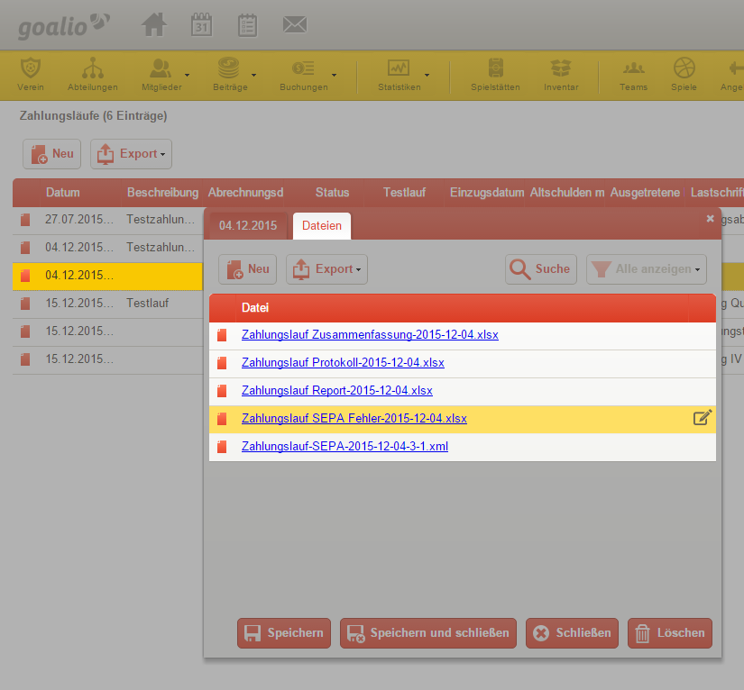

Zahlungslauf
============

Ein Zahlungslauf hat in goalio die Funktion, alle Konten zu saldieren, und die entsprechenden Dateien für Lastschrifteinzüge und Rechnungen anzulegen.

Dabei haben Sie mit goalio die Möglichkeit, zusätzliche Filter einzustellen, welche es Ihnen erlauben, die Abrechnung auf bestimmte Mitglieder zu beschränken, sodass beispielsweise nur die Spieler einer festgelegten Abteilung oder mit einer festgelegten Zahlungsmethode abgerechnet werden.

**Zahlungslauf durchführen**

Gehen Sie folgendermaßen vor, um einen Zahlungslauf durchzuführen:

1. Öffnen Sie in der Navigationsleiste unter dem Menüpunkt *Buchungen* die Seite *Zahlungsläufe*

2. Betätigen Sie die Schaltfläche_ *Neu*, um das Fenster für einen neuen Zahlungslauf aufzurufen

3. Geben Sie zunächst an, zu welchem Datum die Rechnungen gestellt werden sollen, und welches Einzugsdatum für die Lastschrifteinzüge beziehungsweise SEPA-Überweisungen gelten soll

.. note ::
Für einen Lastschrifteinzug werden meist volle fünf Werktage benötigt. Sollte Ihr Verein für das SEPA Expressverfahren (COR1) bei Ihrer Hausbank freigeschaltet sein, können Sie ein Häkchen im entsprechenden Kästchen setzen. Der Lastschrifteinzug benötigt dann lediglich einen vollen Werktag. Bitte informieren Sie sich vorher über vertraglich geregelte mögliche Folgekosten.

4. Legen Sie fest, ob es sich um einen Testlauf handelt, und ob auch Altschulden und bereits ausgetretene Mitglieder mitabgerechnet werden sollen

5. Sollen nicht alle, sondern nur einige Mitglieder abgerechnet werden, so können Sie durch die Felder *Abteilung* und *Payment type* die Auswahl auf bestimmte Abteilungen oder Zahlungsmethoden beschränken

.. tip::
Wenn Sie daran interessiert sind Mitglieder vereinzelt von Zahlungen zurückzustellen, dann können Sie dies über folgenden Pfad: Mitglieder --> Doppelklick auf relevantes Mitglied --> Reiter Zahlung --> Textfeld „von Zahlungen ausnehmen bis …“. Sollten Sie ein Datum hinzufügen, wird dieses Mitglied bis zu diesem Datum innerhalb der Zahlungsläufe nicht abgerechnet.

6. Möchten Sie weitere Informationen zu diesem Zahlungslauf vermerken, so können Sie diese in das Beschreibungsfeld eintippen

7. Der Zahlungslauf wird durchgeführt, sobald Sie die Schaltfläche *Speichern* betätigen. Dies kann besonders bei größeren Vereinen einige Zeit in Anspruch nehmen, in welcher Sie die Seite wechseln oder schließen können

Kehren Sie an einem späteren Zeitpunkt auf die Seite zurück, wird Ihnen im Feld *Status* signalisiert, ob der Zahlungslauf bereits abgeschlossen ist, oder gerade noch durchgeführt wird. Ist er beendet, so finden Sie die generierten Dateien wie folgt:

1. Doppelklicken Sie auf den entsprechenden Zahlungslauf, um Ihn zu öffnen

2. Steuern Sie nun den Reiter_ *Dateien* an

3. Die in der Liste angezeigten Dokumente können Sie jetzt zur weiteren Verwendung mit einem einfachen Klick herunterladen. Sollten keine Dateien angezeigt werden, so aktualisieren Sie die Seite durch Betätigen der Taste :kbd:`F5`.

.. tip ::
Zur besseren Nachverfolgung Ihrer Beitragseinzüge empfehlen wir alle durchgeführten Zahlungsläufe zu erhalten.

 **SEPA-Lastschriftverfahren**
 Neben den Dateien, die den durchgeführten Zahlungslauf beschreiben, erstellt goalio Ihnen eine Datei, die für den Lastschrifteinzug über Ihre Hausbank genutzt werden kann. Laden Sie die dafür erstellte XML-Datei herunter und stellen Sie die Datei so Ihrer Hausbank zur Verfügung. Viele Banken unterstützen den Lastschrifteinzug mittels Datei-Upload im Online-Banking. Für weitere Informationen zum Thema Lastschriftverfahren kontaktieren Sie bitte Ihre Hausbank.

.. _Reiter: /de/latest/erste-schritte/benutzeroberflaeche.html#reiter
.. _Schaltfläche: /de/latest/erste-schritte/benutzeroberflaeche.html#schaltflachen
