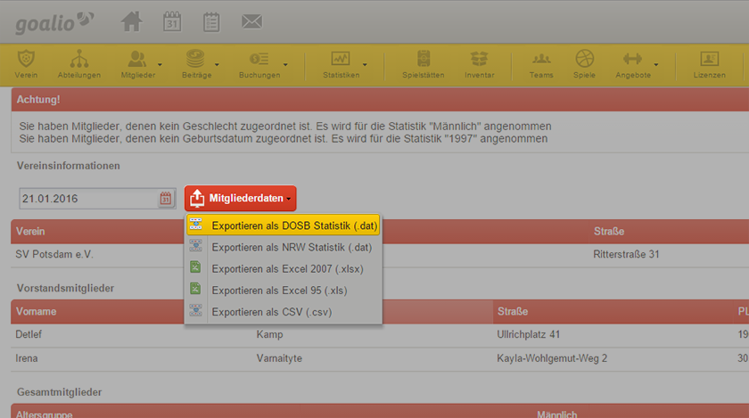

Die LSB-Jahresstatistik 
=======================

Jedes Jahr sind Sportvereine dazu aufgerufen die Meldestatistik an ihre jeweiligen Landesverbände zu übermitteln. Die Meldestatistik lässt sich dabei mit goalio in wenigen Minuten abschließen. Gehen Sie dabei wie folgt vor:

.. warning::
 Stellen Sie sicher, dass die notwendigen Vereins- (Name, LSB-Nummer) und Abteilungsinformationen (Name, Verein, Verband & Sport)  für die Meldestatistik im goalio-System hinterlegt sind.

1. Navigieren Sie mit der Maus über den Menüpunkt Statistik
2. Wählen Sie im angezeigten Auswahlmenü die Schaltfläche LSB-Jahresstatistik
3. Falls Sie einen abweichenden Stichtag nutzen wollen, nutzen Sie das dafür vorgesehene Feld
4. Exportieren und Speichern Sie die Mitgliederdaten als DOSB-Statistik

  
Nachdem Sie die DOSB-Statistik erfolgreich exportiert haben, müssen Sie die in der Datei hinterlegten Daten dem jeweiligen Landessportbund zukommen lassen. Nutzen Sie das dafür bereitgestellte System ihres Landessportbundes.
