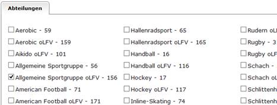
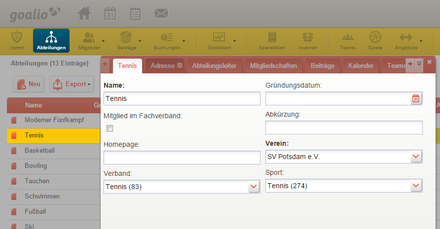
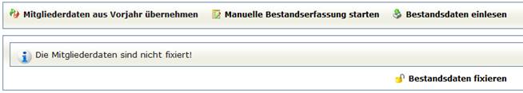

LSB-Jahresstatistik in Brandenburg
===================================================

Sollte Ihr Verein dem Landessportbund Brandenburg zugehörig sein, müssen Sie bei der Bestandsmeldung einige kleine Dinge beachten. Wenn goalio in Ihrem Verein bereits seit 2013/2014 eingesetzt wird und die Abteilungen unverändert sind, entfallen die Schritte 1-3. Gehen Sie für die Bestandsmeldung des LSB-Brandenburg wie folgt vor:

1. Loggen Sie sich mit Ihrem Vereins-Zugangsdaten bei Verminet ein und kreuzen Sie die jeweiligen Abteilungen an, die Sie melden möchten

   
   
2. Öffnen Sie Ihre goalio-Software-Oberfläche und überprüfen Sie die DOSB-Nummer und Fachverbandsnummer jeder zu meldeten Abteilung

.. note:: 
 Die Verbandsnummern in Brandenburg waren früher nach einem anderen System zugewiesen und wurden in Verminet noch nicht an die DOSB-Spezifikation angeglichen. Daher müssen die Abteilungsnamen (siehe Punkt 1) in `hier hinterlegten PDF <https://owncloud.goalio.de/index.php/s/ggrOtcrfbBvR6WU>`_ nachgeschlagen werden.

3. Pflegen Sie die zugehörige DOSB-Nummer und Fachverbandsnummer anhand der bereitgestellten PDF bei den jeweiligen Abteilungen nach und speichern Sie die Eingaben

  
  
4. Erstellen Sie eine DOSB-Statistik mit goalio (SIEHE LSB STATISTIK)
5. Lesen Sie die Bestandsdaten über Verminet ein

  
  
In Verminet gehen Sie wie folgt vor:

a. Navigieren Sie bei Verminet über Bestandsmeldung auf die entsprechende Seite
b. Klicken Sie auf die Schaltfläche Bestandsdaten einlesen (siehe Bild 3)
c. Wählen Sie das Format DOSB-Import
d. Wählen und bestätigen Sie die zuvor bei goalio exportierte Datei
e. Bei Bedarf können die Daten manuell verändert werden
f. Fixieren Sie die Bestandsdaten
