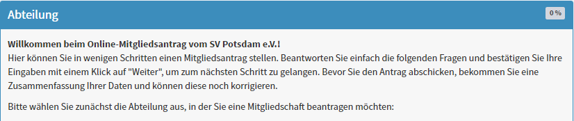
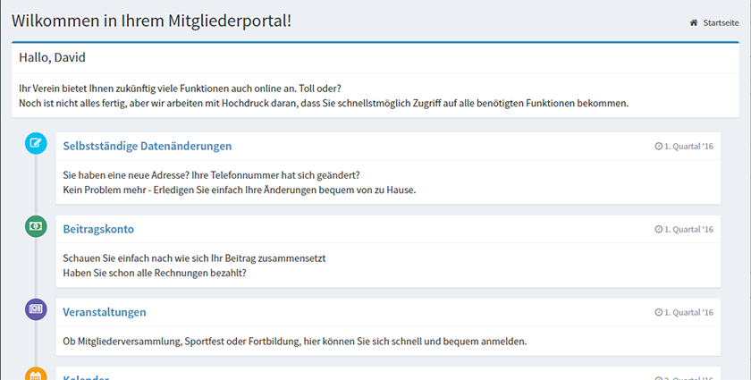
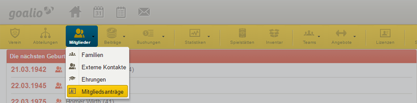

Funktionsumfang
===============
Der digitale Mitgliedsantrag bietet Ihnen die Möglichkeit Ihr Vereinsanmeldungsprozess zu digitalisieren und gleichzeitig von der Schnittstelle zum goalio-Vereinssystem zu profitieren, indem Sie eingetragene Informationen nur noch bestätigen müssen.

Digitaler Anmeldeprozess
------------------------
Mit dem digitalen Mitgliedsantrag wird ein potentielles Neumitglied in die Lage versetzt, sich für Ihren Verein via Smartphone, Tablet oder auch PC anzumelden. Der Mitgliedsantrag passt sich dabei auf Grundlage ihrer vorgenommenen Einstellungen bei goalio an und kann so individuell angepasst werden. Nicht jede angelegte Abteilung muss damit im Digitalen Mitgliedsantrag sichtbar sein.

Folgende freigegebene Inhalte bestimmen den Digitalen Mitgliedsantrag:  
  1. Abteilungen
  2. Aufnahmegebühr := Allgemeine Aufnahmegebühr + Spezielle Aufnahmegebühr
  3. Teams & Angebote

Folgende Informationen werden vom Mitglied selber eingetragen:  
  1. Mitgliedschaftsbeginn
  2. Stamm-, Adress- und Kontaktdaten
  3. Zahlungsinformationen (Lastschrift)

Self-Service-Portal
-------------------
In Kombination mit dem digitalen Mitgliedsantrag wird den Mitgliedern künftig ein Self-Service-Portal für Ihren Verein angeboten, das in naher Zukunft immer mehr an Funktionalität gewinnen wird. Beispielsweise werden Mitglieder künftig die Möglichkeit haben, Stamm-, Adress- und Kontaktdaten selbstständig anzupassen. Sie müssen nur noch bestätigen.

Bereitstellung von Dokumenten
-----------------------------
Mit dem Abschluss der Online-Anmeldung werden dem Neumitglied die Zusammenfassung der Anmeldung und das SEPA-Lastschriftmandat als Download bereitgestellt. Das Neumitglied muss diese Dokumente nur noch Ausdrucken, Unterschreiben und Ihnen für Ihre Unterlagen übergeben. 

Automatisierter Mailversand
---------------------------
Nachdem das Mitglied alle Information übermittelt hat, wird ein automatisierter Prozess für den E-Mailversand angestoßen.

Folgende E-Mails werden an den Verein und seine Funktionäre versendet:  
  1. Informationen an die Abteilungsleiter, Trainer und Übungsleiter (inkl. der Aufforderung eine Rückmeldung zum neuen Mitglied zu geben)

Folgende E-Mails werden an das Mitglied versendet:  
  1. Bestätigungsinformationen bei Abschluss der Online-Anmeldung (inkl. Link zur Zusammenfassung der Anmeldung und dem SEPA-Lastschriftmandat)
  2. Bestätigungsinformationen bei der Annahme des Mitgliedantrages (inkl. Zugangsdaten zum Self-Service Portal)

Vereinsinterne Abstimmung
-------------------------
Mit dem E-Mailversand an die Abteilungsleiter, Trainer und Übungsleiter werden diese in den Anmeldeprozess mit integriert. Damit stellen Sie sicher, dass auch nur die Mitglieder aufgenommen werden von denen Trainer, Übungsleiter oder auch Abteilungsleiter Kenntnis haben. 

.. image:: ../../images/gui/dma_membership.png

Bestätigung und Import von Mitgliedern
--------------------------------------
Nachdem die Übungsleiter, Trainer und Abteilungsleiter über die Aufnahme des Neumitglieds erfolgreich bestimmt haben, kann das neue Mitglied durch die Mitgliederverwaltung in das goalio-System importiert werden. Sollten noch Änderungen am Datensatz vorgenommen werden müssen, kann dies vor dem Überführen durchgeführt werden.

